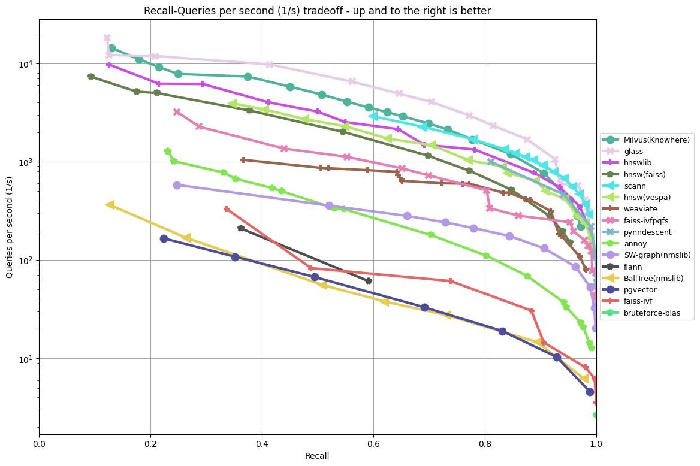
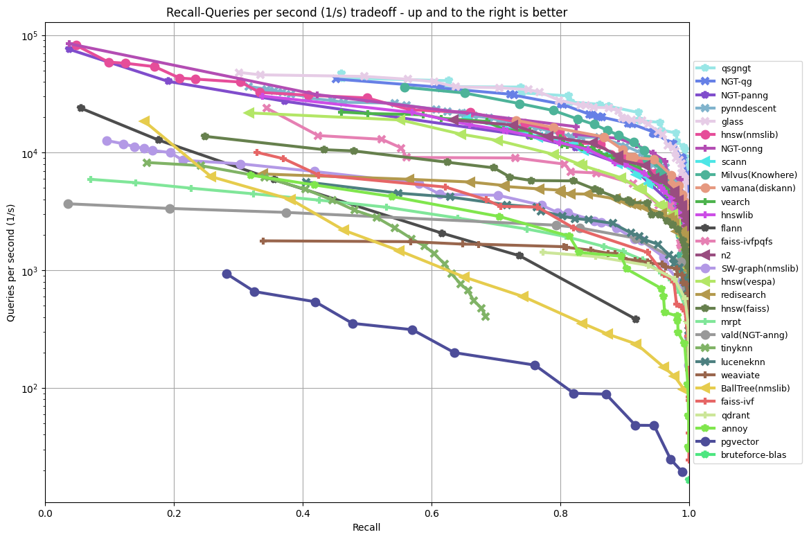

# Graph Library for Approximate Similarity Search

pyglass is a library for fast inference of graph index for approximate similarity search.

## Features

- Supports multiple graph algorithms, like [HNSW](https://github.com/nmslib/hnswlib) and [NSG](https://github.com/ZJULearning/nsg).
- Supports multiple hardware platforms, like **AVX2**, **AVX512** and **NEON**.
- No third-party library dependencies, does not rely on BLAS / NNPACK or any other computing framework.
- Sophisticated memory management and data structure design, very low memory footprint.
- It's high performant.

## Installation
### (Recommanded)Installation from Wheel
pyglass can be installed using pip as follows:
```bash
pip3 install glassppy
```

### Installation from Source
``` bash
sudo apt-get update && sudo apt-get install -y build-essential git python3 python3-distutils python3-venv
```
``` bash
pip3 install numpy
pip3 install pybind11
```
``` bash
bash build.sh
```

## Quick Tour

```python
>>> import glassppy as glass
>>> import numpy as np
>>> n, d = 10000, 128
>>> X = np.random.randn(n, d)
>>> Y = np.random.randn(d)
>>> index = glass.Index("HNSW", dim=d, metric="L2", R=32, L=50)
>>> graph = index.build(X)
>>> searcher = glass.Searcher(graph, X, "L2", 0)
>>> searcher.optimize()
>>> searcher.set_ef(32)
>>> print(searcher.search(Y, 10))
```

## Usage
**Import library**
```python
>>> import glassppy as glass
```
**Load Data**
```python
>>> n, d = 10000, 128
>>> X = np.random.randn(n, d)
>>> Y = np.random.randn(d)
```
**Create Index**
pyglass supports **HNSW** and **NSG** index currently
```python
>>> index = glass.Index(index_type="HNSW", dim=d, metric="L2", R=32, L=50)
>>> index = glass.Index(index_type="NSG", dim=d, metric="L2", R=32, L=50)
```
**Build Graph**
```python
>>> graph = index.build(X)
```
**Create Searcher**
Searcher accepts `level` parameter as the optimization level. You can set `level` as `0` or `1` or `2`. The higher the level, the faster the searching, but it may cause unstable recall.
```python
>>> optimize_level = 2
>>> searcher = glass.Searcher(graph=graph, data=X, metric="L2", level=optimize_level)
>>> searcher.set_ef(32)
```
**(Optional) Optimize Searcher**
```python
>>> searcher.optimize()
```
**Searching**
```python
>>> ret = searcher.search(query=Y, k=10)
>>> print(ret)
```

## Performance

Glass is among one of the top performant ann algorithms on [ann-benchmarks](https://ann-benchmarks.com/)

### fashion-mnist-784-euclidean

### gist-960-euclidean

### sift-128-euclidean


### Quick Benchmark

1. Change configuration file `examples/config.json`
2. Run benchmark
```
python3 examples/main.py
```
3. You could check plots on `results` folder